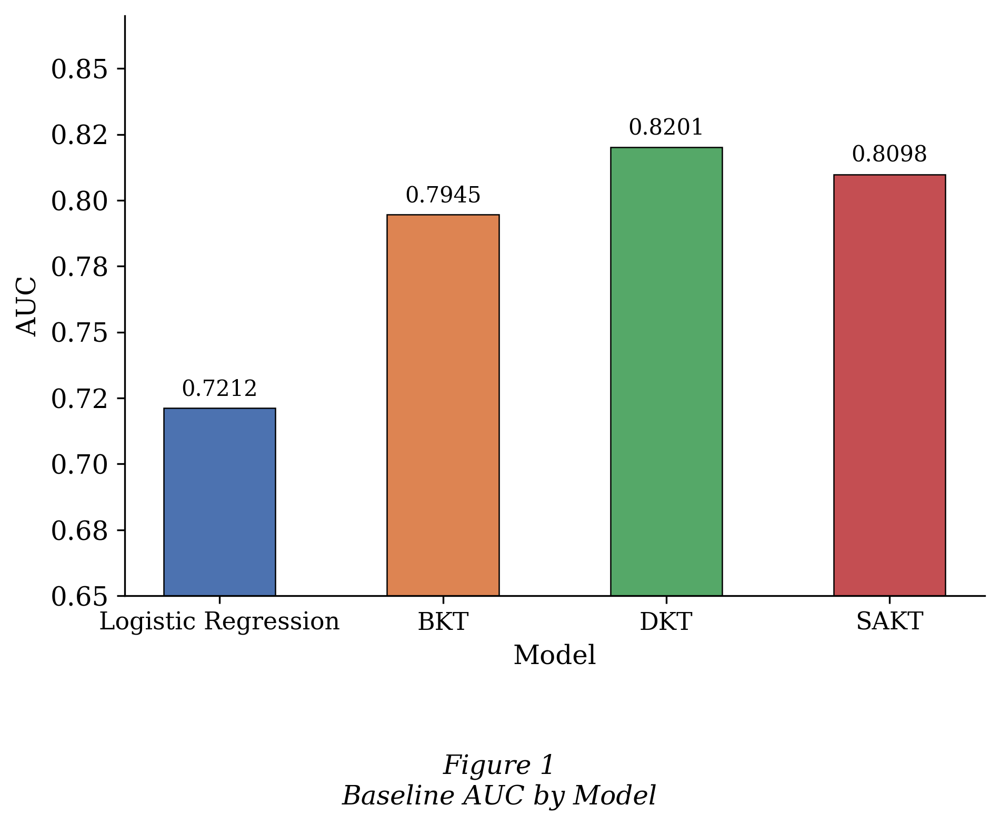
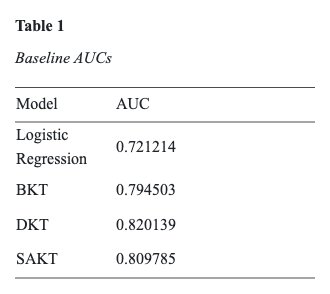
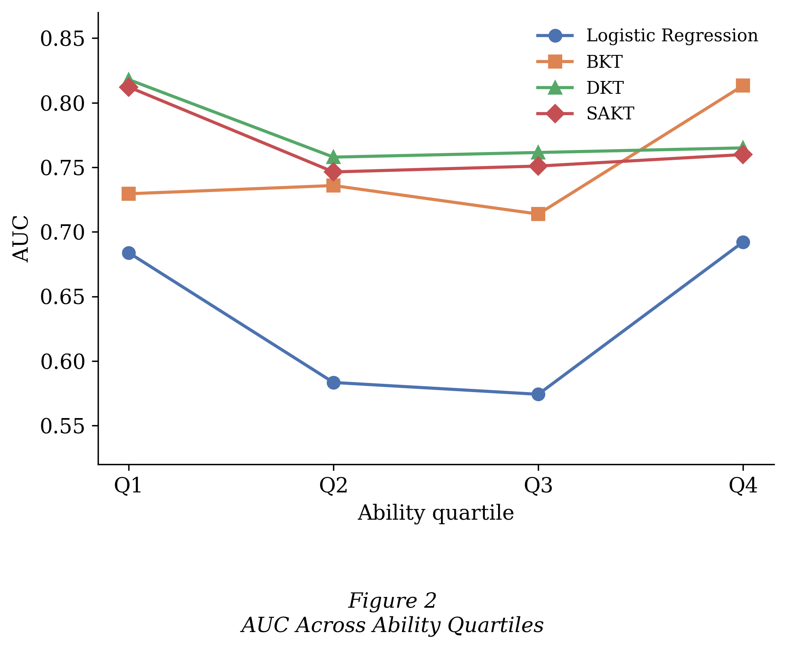
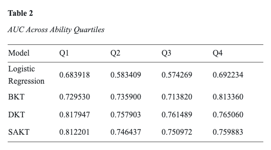
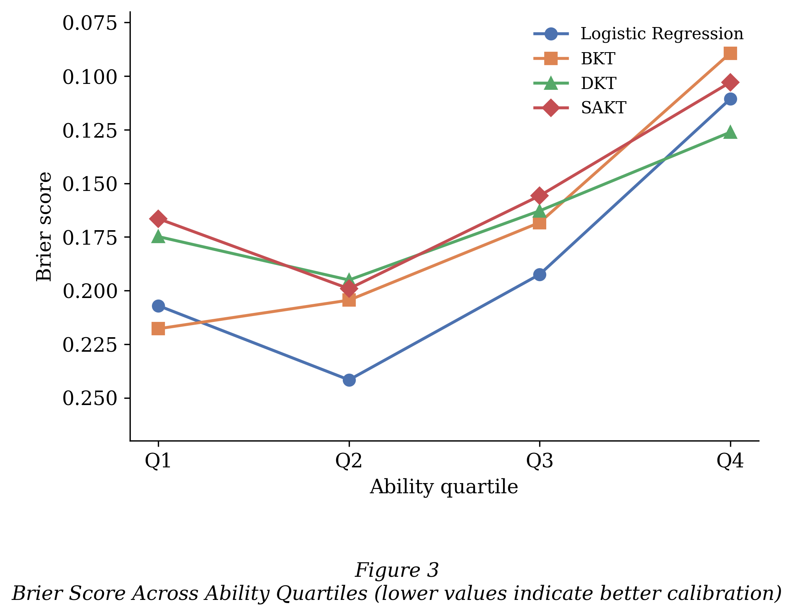
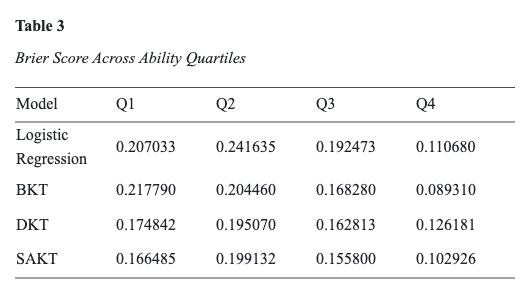

# 4. Results

The performance of each knowledge tracing model was evaluated in two stages. First, each model was trained and evaluated on the standard 80/20 student-level split to establish a baseline. Second, each model was trained on the ability-stratified training set and evaluated separately on each of the four ability quartiles (Q1–Q4), where Q1 represents the lowest-ability students and Q4 the highest. In the evaluation, higher AUC and lower Brier Score both indicate better performance.

## 4.1 Baseline Results

Before examining ability-stratified performance, each model was evaluated on the overall test set to confirm that the expected performance ordering held. As shown in Table 1 and Figure 1, DKT achieved the highest baseline AUC, followed by SAKT, BKT, and Logistic Regression. This was done to validate that all four implementations are functioning correctly.

  
  

## 4.2 AUC Across Ability Quartiles

Table 2 and Figure 2 present the AUC for each model across the four ability quartiles.

  
  

The two neural models, DKT and SAKT, achieved the strongest discrimination across Q1, Q2, and Q3, with DKT slightly outperforming SAKT in all three groups. Logistic Regression performed considerably worse in the middle ability groups, with AUC values well below those of the other three models in Q2 and Q3.

The most striking pattern was observed in Q4. BKT, which showed the weakest discrimination among the non-LR models across Q1 through Q3, substantially improved in the highest-ability group and outperformed all other models. DKT and SAKT, by contrast, showed relatively stable AUC values across all four quartiles with only modest variation between groups.

Overall, the AUC results suggest that model rankings are not stable across ability levels. The advantage of neural models over BKT narrows considerably and reverses in Q4 as student ability increases.

## 4.3 Brier Score Across Ability Quartiles

Table 3 and Figure 3 present the Brier Score for each model across the four ability quartiles.

  
  

The Brier Score results reveal a clearer directional pattern than the AUC results. Across all models, probabilistic calibration improved as student ability increased: Brier Scores generally decreased from Q1 to Q4. This improvement was most dramatic for BKT, which achieved by far the lowest Brier Score of any model in Q4, and most modest for DKT.

SAKT produced the best probabilistic calibration for Q1 and Q3, while BKT was strongest in Q2 and Q4. DKT showed consistently moderate Brier Scores across all groups but did not lead in any quartile. Logistic Regression performed worst in the middle ability groups, consistent with its AUC results, though it improved substantially in Q4.

The Q4 Brier Score for BKT stands out as the single most notable result in the dataset. BKT's Brier Score dropped sharply from Q1 to Q4, a pattern not observed to the same degree in the neural models. This suggests that BKT's probabilistic predictions become substantially more accurate as student ability increases, while DKT and SAKT remain more consistent but less dramatically improved across the ability spectrum.
